# wtest — Windows 에이전트 병렬 자동 테스트 아키텍처

> 상태: 설계 초안 v0.2 (2026-10-08, M1 구현 반영)
> 핵심 결정: Hyper-V + 차등 디스크 / VM 1대당 Claude 1세션 / 직접 통신 없이 MCP 공유 저장소로 협업 / RAG 전용(CAG 미사용) / 구조 유사도 70% 이상이면 동일 테스트

---

## 1. 전체 구성

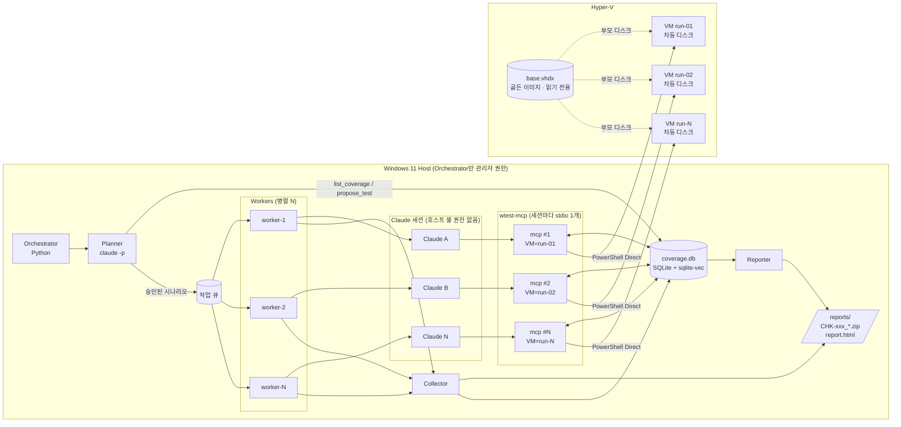

**원칙**
- Claude 세션끼리는 직접 통신하지 않는다. 모든 공유는 `coverage.db`를 통해서만 한다.
- Claude에게는 호스트 셸을 주지 않는다. 자기 VM에 묶인 MCP 도구만 준다.
- 프롬프트에는 행동 규칙만 넣고, 지식은 모두 MCP로 조회한다(RAG).

---

## 2. 전체 파이프라인

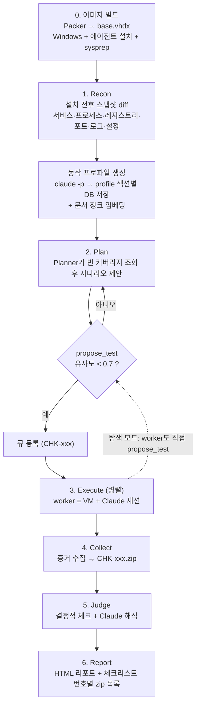

---

## 3. VM 수명 주기 (Docker 대응)

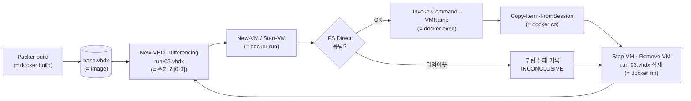

---

## 4. Worker 1회 실행 시퀀스

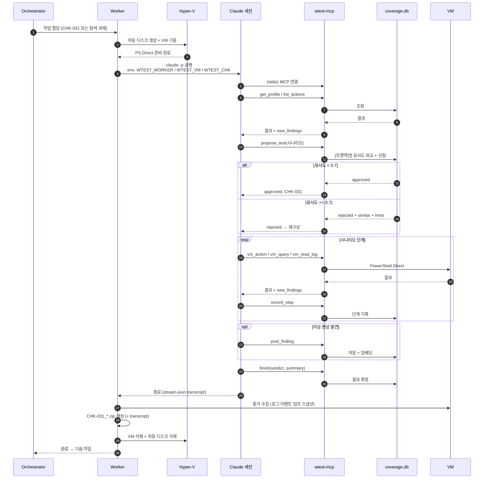

---

## 5. Claude 세션 행동 루프

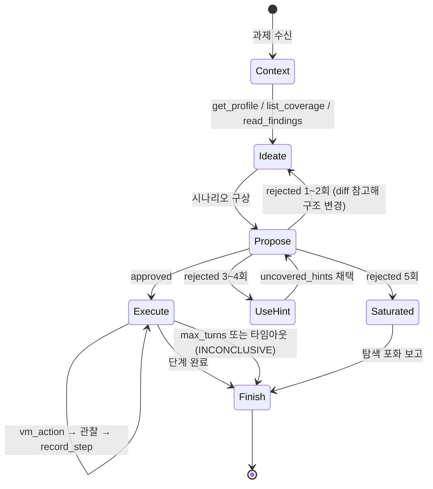

---

## 6. propose_test 판정 로직

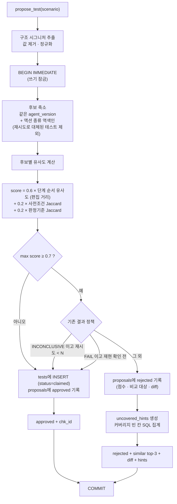

**시그니처 예시**

| 원본 | 시그니처 |
|---|---|
| `set_config(key=timeout, value=30)` | `set_config:timeout` |
| `block_network(port=443)` | `block_network` |
| `restart_service(svc=AgentSvc)` | `restart_service` |
| `wait(60)` | `wait` |

임계값, 가중치, 값 경계 클래스 사용 여부(`normal/boundary/invalid`)는 설정 파일로 관리한다.

- 후보 축소도 잠금 안에서 한다. 잠금 밖에서 후보를 고르면 그 사이 다른 worker가 넣은 시나리오를 놓쳐 중복 승인이 생긴다.
- 유사 테스트가 여럿이면 **모두** 재승인 가능할 때만 승인한다. 재승인되면 새 CHK를 만들고 원본은 `superseded_by`로 후보에서 뺀다.
- "FAIL 재현 확인 전"은 직전 테스트(`retry_of`)가 FAIL이 아닌 FAIL을 뜻한다. FAIL → FAIL이면 재현 확인으로 본다. 모든 재승인은 `max_retries`로 제한한다.

---

## 7. MCP 도구 구성

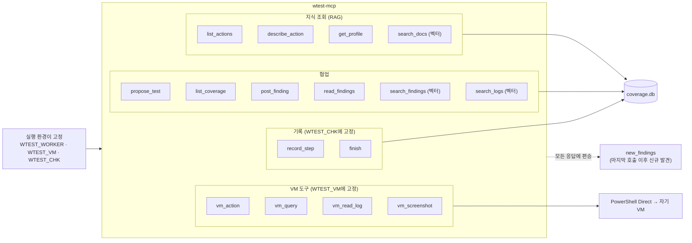

- **CHK 고정 범위**: 고정 모드는 `WTEST_CHK`로 시작부터 정해진다. 탐색 모드는 `propose_test` 승인 시점에 세션 CHK가 정해지며, 그 전에는 `record_step`·`finish(PASS|FAIL|INCONCLUSIVE)`를 쓸 수 없다. 세션 하나는 CHK 하나만 가진다.
- 세션 내 거절 횟수에 따라 응답의 `guidance`가 바뀐다(§5). 거절 한도에 도달하면 `propose_test`는 거부되고 `finish(verdict="SATURATED")`만 남는다.
- `new_findings`는 세션 시작 이후 **다른** worker가 올린 발견만 싣는다.
- `search_*`는 M5 전까지 벡터 대신 부분 문자열 검색으로 동작한다(도구 인터페이스는 동일).

---

## 8. 데이터 모델 (coverage.db)

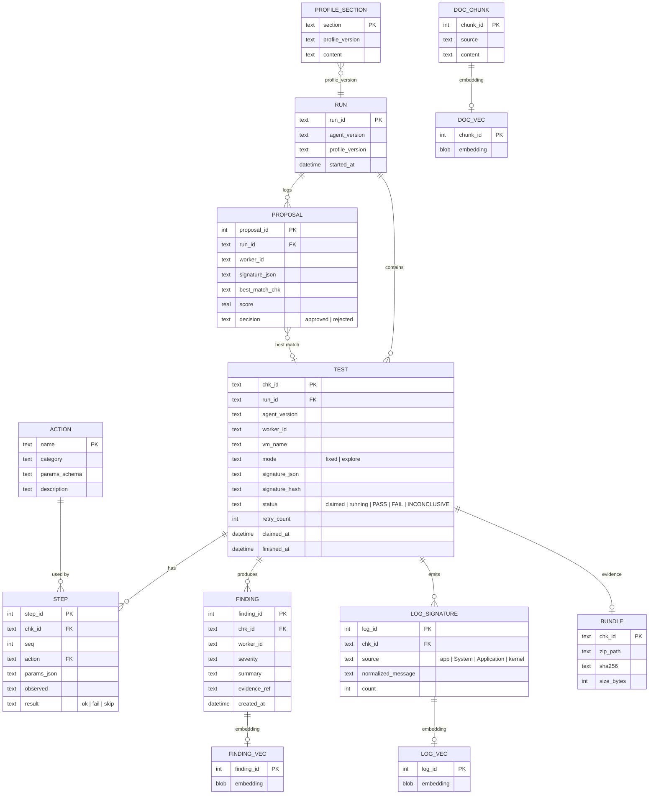

- M1 구현에서 추가한 열·테이블: `TEST.title · area · scenario_json · retry_of · superseded_by · summary`, `PROPOSAL.approved_chk`, 후보 축소 역색인 `test_action(chk_id, action)`, 세션 이벤트 `worker_event`(탐색 포화 보고 등).
- `coverage`는 별도 테이블이 아니라 `TEST`와 `STEP`을 영역 × 액션 × 조건으로 집계한 뷰로 둔다.
  - M1의 `coverage` 뷰는 영역 × 액션까지만 집계한다. 조건 축은 Recon 프로파일로 조건 어휘가 정해지는 M3에서 추가한다.
- `*_VEC`는 sqlite-vec 가상 테이블이며, 임베딩은 로컬 다국어 모델로 생성한다.
- SQLite는 WAL 모드로 여러 MCP 프로세스의 동시 읽기·쓰기를 처리한다.

---

## 9. 증거 번들 구조

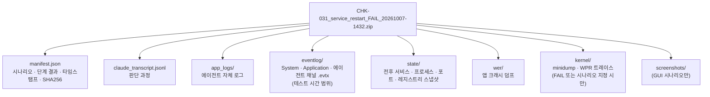

---

## 10. 권한과 격리 경계

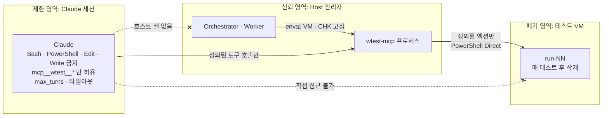

액션 카탈로그에 없는 동작은 실행할 수 없으므로, 테스트 범위를 벗어나는 행동은 구조적으로 차단된다.

---

## 11. 마일스톤

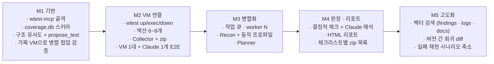

---

## 12. 미정 사항

| 항목 | 상태 |
|---|---|
| 테스트 대상 에이전트 형태 (GUI · 서비스 · 드라이버) | 미정. UI 자동화와 커널 수집 범위가 여기에 따라 결정됨 |
| 골든 이미지 확보 방법 (평가판 ISO · 사내 이미지) | 미정 |
| 호스트 RAM, 즉 병렬 VM 수 | 미정 (VM당 약 4GB 가정) |
| Claude 연결 방식 | M1~M2는 `claude -p --strict-mcp-config --tools= --allowedTools mcp__wtest`(M1 스모크 확인), 이후 Agent SDK 전환 검토 |
| 임베딩 모델 | 로컬 다국어 모델 (M5에서 확정) |
